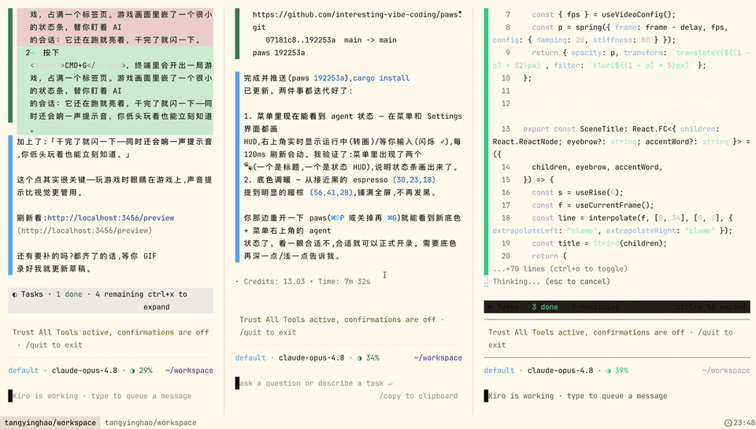

[English](README.md) | 中文

<div align="center">

# 🐾 Paws

[](https://github.com/interesting-vibe-coding/paws/actions/workflows/ci.yml) [](LICENSE) [](https://github.com/interesting-vibe-coding/paws#install) []() [](https://github.com/interesting-vibe-coding/paws/pulls) [](https://github.com/interesting-vibe-coding/paws/stargazers)

Agent 工作时尽情玩，需要你时一眼就看到。

</div>

<p align="center"></p>

AI 编程 Agent 的终端伴侣。按 CMD+G 选一个游戏，在全窗口标签页里玩。游戏顶行叠加实时状态栏，显示哪些 session 在跑、哪些已完成并闪烁提醒——你想切回去时再切。

## 使用

| 按键 | 功能 |
|------|------|
| **CMD+G** | 首次：打开游戏选择菜单；之后：在 Agent ↔ 游戏间切换 |
| **CMD+SHIFT+P** | 重新打开菜单，换游戏 |
| **CMD+H** | 在浏览器中打开 Paws 仓库 |

HUD 显示 session 状态（运行中 / 已完成），完成时闪烁。不会自动切换——主动权在你。

## 安装

### 1. 让你的 Agent 来装（推荐）

> "用 `paws/skills/paws-install/SKILL.md` 里的 skill 安装 Paws。"

支持 **Kiro CLI**、**Claude Code** 和 **Codex CLI** —— 各 Agent 的配置详见 [安装 skill](skills/paws-install/SKILL.md)。

### 2. Homebrew

```bash
brew install --HEAD interesting-vibe-coding/paws/paws       # paws 本体
brew install --HEAD interesting-vibe-coding/paws/paws-games  # 三个游戏
```

正式的 `brew tap interesting-vibe-coding/paws && brew install paws` 需要打 release tag 后才可用——详见 [Formula/README.md](Formula/README.md)。

### 3. 手动安装

```bash
cargo install --path .                                       # 编译 paws
cargo install --git https://github.com/interesting-vibe-coding/paws-games --bin jump-high
cargo install --git https://github.com/interesting-vibe-coding/paws-games --bin earth-online
cargo install --git https://github.com/interesting-vibe-coding/paws-games --bin tetris
```

然后配置终端集成，并为你的 Agent 配置 hooks（参考 [`hooks/`](hooks/) 目录）。
- **Kaku：** 将 [`lua/paws.lua`](lua/paws.lua) 添加到 `~/.config/kaku/kaku.lua` 的 `return config` 之前 — 重载需按 CMD+Shift+R
- **WezTerm：** 将 [`lua/paws.lua`](lua/paws.lua) 添加到 `~/.config/wezterm/wezterm.lua` — 保存后自动重载
- **iTerm2：** 将 [`iterm2/paws.py`](iterm2/paws.py) 复制到 `~/.config/iterm2/scripts/AutoLaunch/`，绑定 3 个快捷键 — 详见[安装指南](docs/iterm2-setup.md)
- **tmux：** 将 [`tmux/`](tmux/) 脚本复制到 `~/.config/paws/`，在 `~/.tmux.conf` 加 2 行 — 详见[安装指南](docs/tmux-setup.md)

## 游戏

| 游戏 | 二进制 | 说明 |
|------|--------|------|
| 🐕 Dog Jump | `jump-high` | Jump King 风格平台跳跃——蓄力、瞄准、听天由命 |
| 🌍 Earth Online | `earth-online` | Agent 工作时的现实世界支线任务 |
| 🧱 Tetris | `tetris` | 经典方块消除，带等级和计分 |

不够玩？在选择菜单里进入 **⤓ Install games**,浏览目录并就地安装更多。这个目录就是 [paws-games](https://github.com/interesting-vibe-coding/paws-games) 插件库——欢迎贡献你自己的游戏。

## 工作原理

Agent hook 把 session 状态写入 `/tmp/paws-sessions/` → Kaku Lua 处理 CMD+G（创建/切换标签页）→ `paws` 把游戏托管在 PTY 里并在顶行渲染 HUD。游戏是通过 [registry](registry.toml) 发现的独立二进制。

架构详情见 [docs/ARCHITECTURE.md](docs/ARCHITECTURE.md)。

## 贡献

想添加游戏或改进 Paws？请查看 [CONTRIBUTING.md](CONTRIBUTING.md)，里面有游戏二进制契约、registry 格式和 PR 检查清单。

---

更多项目 → [doabit.dev](https://doabit.dev) · 许可证：MIT
