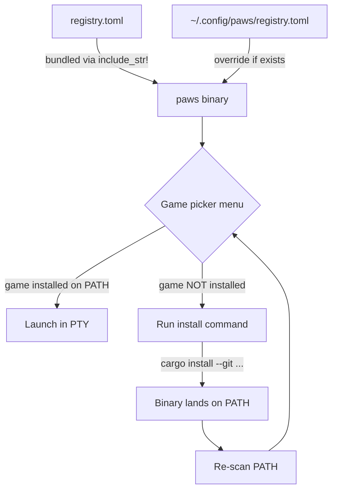

# Paws Architecture

A concise overview of how Paws works internally.

## Runtime Flow

```
┌─────────────────────────────────────────────────────────────────┐
│  Agent (Kiro / Claude Code / Codex)                             │
│    │                                                            │
│    ├── hook fires on UserPromptSubmit → paws signal busy        │
│    └── hook fires on Stop             → paws signal done        │
│                                                                 │
│         writes state to: /tmp/paws-sessions/<session-id>        │
└─────────────────────────────────────────────────────────────────┘
         │
         ▼
┌─────────────────────────────────────────────────────────────────┐
│  Kaku (WezTerm-based terminal)                                  │
│                                                                 │
│    kaku.lua binds:                                              │
│      CMD+G      → spawn paws tab / toggle to it                │
│      CMD+SHIFT+P → close tab + re-open picker                  │
│                                                                 │
│    The paws tab runs the `paws` binary.                         │
└─────────────────────────────────────────────────────────────────┘
         │
         ▼
┌─────────────────────────────────────────────────────────────────┐
│  paws (Rust binary)                                             │
│                                                                 │
│    1. Loads registry.toml (bundled or ~/.config/paws/)          │
│    2. Shows game picker menu                                    │
│    3. Spawns chosen game in a child PTY                         │
│    4. Renders game output below row 0                           │
│    5. Overlays HUD on TOP row (row 0) — reads session files     │
│                                                                 │
│    ┌────────────────────────────────────────────┐               │
│    │ row 0: HUD  🐾 ⠹ 2 working  ✓ 1 waiting  │               │
│    │ row 1..N: game PTY output                  │               │
│    └────────────────────────────────────────────┘               │
└─────────────────────────────────────────────────────────────────┘
```

## Registry & In-Menu Install



**Registry format** (`registry.toml`):

```toml
[[game]]
id = "jump-high"
name = "Dog Jump"
icon = "🐕"
cmd = "jump-high"
install = "cargo install --git https://github.com/MisterBrookT/paws-games --bin jump-high"
description = "Jump King-style platformer — one dog, gravity, no mercy."
```

Users can override the bundled registry by placing their own at `~/.config/paws/registry.toml`.

## Game Binary Contract

Games are **standalone terminal binaries** on `PATH`. The Paws host:

- Spawns the game in a PTY sized `(cols, rows-1)` — one row shorter than the terminal
- Overlays a HUD on the **top row** (row 0)
- Forwards all stdin to the game PTY

**Requirements for game binaries:**

| Rule | Why |
|------|-----|
| Must not depend on row 0 | Paws paints the HUD there |
| Must handle terminal resize (SIGWINCH) | User can resize the window |
| Must exit cleanly on stdin EOF | Paws drops the PTY on quit |
| Binary name = the `cmd` field in registry | Discovery via PATH scan |

For the full contract with code examples and tips, see the paws-games repo: [`docs/GAME_CONTRACT.md`](https://github.com/MisterBrookT/paws-games/blob/main/docs/GAME_CONTRACT.md).
